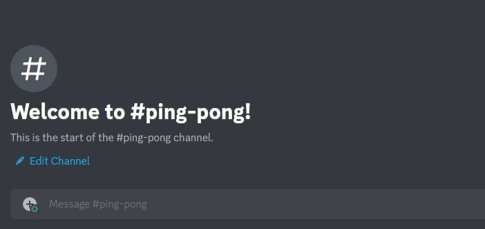
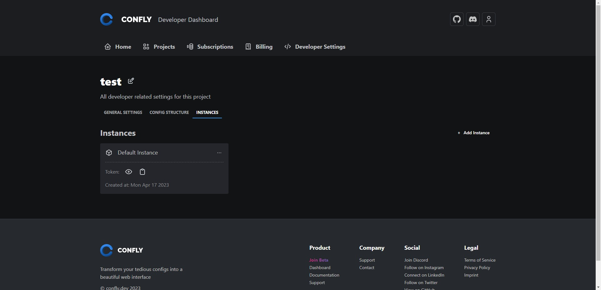
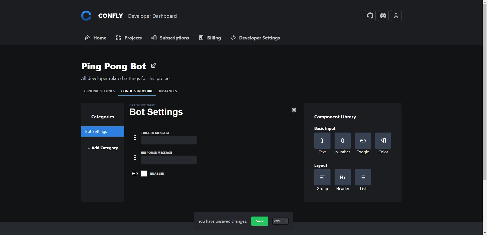

import { Callout } from "nextra/components";

# Discord Bot

> _Discord Bots was the original use case for Confly. We use it to manage our own Discord Bot and it works great. I have always loved creating Discord Bots and I am excited to share this tutorial with you._
>
> ~[Julius](https://github.com/p3ntest), CEO of Confly

In this short walk-through, we will create a Confly powered Discord Bot using the [Discord.js](https://discord.js.org/#/) framework on [NodeJS](https://nodejs.org/). You will learn how to use our cli to create and maintain projects, define a confly structure and deploy your config. By the end you will have a fun bot that will respond to your messages and can be easily configured using Confly.

<Callout type="info" emoji="ℹ️">

You should have a basic understanding of Discord.js and NodeJS to follow this tutorial. If you are new to Discord.js, you can follow their [official guide](https://discordjs.guide/) to get started.

</ Callout>

## Step 1: Create a basic Discord Bot using Discord.js

Create a directory for your project and run `npm init -y` to initialize a new node project. Then install the discord.js package using `npm install discord.js`. You can now create a new file called `index.js` and add the following code:

```js title="index.js"
const Discord = require("discord.js");
const config = require("./config.json");

const client = new Discord.Client({
  // Setup the client with the required intents and partials to read messages
  intents: ["Guilds", "DirectMessages", "GuildMessages", "MessageContent"],
  partials: [Discord.Partials.Message, Discord.Partials.Channel],
});

client.on("ready", () => {
  console.log(`Logged in as ${client.user.tag}!`);
});

client.on("messageCreate", (msg) => {
  if (msg.content === "ping") {
    msg.reply("Pong!");
  }
});

client.login(config.discord_token);
```

Make sure to also create a `config.json` file and add your Discord Bot token to it:

```json title="config.json"
{
  "discord_token": "<YOUR_DISCORD_BOT_TOKEN>"
}
```

<Callout type="info" emoji="ℹ️">

To learn how to create a Discord Bot and add it to your server, you can follow the [official guide](https://discordjs.guide/preparations/setting-up-a-bot-application.html#creating-your-bot). Be sure to give it a creative name and a nice profile picture.

</ Callout>

This bot will listen for the `ping` message and reply with `Pong!`. You can now run your bot using `node index.js` and test it by sending a `ping` message to your bot in Discord.

<Callout type="warning" emoji="⚠️">
  Make sure to enable the Message Content Intent on your Bot's page in the
  Discord Developer Portal. This is required for the bot to receive messages.
  More on this [here](https://stackoverflow.com/a/73037243/13449474).
</Callout>

As you can see, our bot will respond to the `ping` message.



But what if we want to change the response? We would have to change the code and redeploy the bot. This is not ideal. We can use Confly to make this easier.

## Step 2: Create your confly project

First of all we need to create a Confly project on the [Confly Dashboard](https://confly.dev/dashboard/projects). You can do this by clicking on the `+ Add Project` button in the top right corner of the projects page. Give your project a name and click `Create`.


We also need an instance for our project. Instances allow you to have multiple configurations for the same project, they represent individual deployments of the same application. For example, you could have a `dev` instance for development and a `prod` instance for production without having to create a new project and copy the config structure. This is also useful if you have multiple bots that use the same config structure, for example when creating a Saas product or just deploying multiple bots.

Conveniently new projects come with a default instance called `Default Instance`. You can create a new instance by clicking on the `+ Add Instance` button in the top right corner of the instances page, but this tutorial, we will use the default instance.



Every instance has a unique secret token that we will use to fetch the config. You view or copy the token by clicking the icons on the instance card respectively. We will need this token for our bot to fetch the config later, so lets add it to our `config.json`. Click on the clipboard icon to copy it and then add a new line in `config.json`:

```json title="config.json"
{
  "discord_token": "<YOUR_DISCORD_BOT_TOKEN>",
  // highlight-start
  "confly_token": "<YOUR_CONFLY_INSTANCE_TOKEN>"
  // highlight-end
}
```

## Step 3: Create your config structure

The next step is to tell Confly what our config structure looks like. Our goal is to create two input fields: One for the trigger message (`ping`) and one for the response message (`Pong!`). We will also add a checkbox to enable or disable the bot's functionality entirely.

On the project page, go to the `Config Structure` tab. You will see a category called `Main Settings` by default. From the library on the right, drag two `Text` inputs and one `Toggle` into the category. You can label the fields by hovering over them and opening the settings menu on the right by clicking on the gear icon. You can also change the category name by clicking on title or the gear icon next to it. We will name the category `Bot Settings` and the inputs `Trigger Message`, `Response Message` and `Enabled`. Your config structure should now look like this:

Your config structure should now look like this:



We also want to specify how these values will be represented in the config. When our application consumes the config, it will receive a JSON object with the values of the inputs. We can specify the keys of this object by clicking on the gear icon next to the input label and changing the `Key` field. When not specified, the key will be a camel cased version of the label. (e.g. `Trigger Message` -> `triggerMessage`). We will change the keys to `trigger`, `response` and `enabled` respectively. This can be done by clicking on the gear icon next to the input label and changing the `Key` field. (The `enabled` key is already correct by default, so you don't have to change it)

<Callout type="info" emoji="ℹ️">
  Categories can also have keys. They will be used as prefixes for the keys of
  the inputs in the category. For example, if we set the key of the `Bot
  Settings` category to `bot`, the keys of the inputs will be `bot.trigger`,
  `bot.response` and `bot.enabled`. By default, the key of a category is empty.
  This means that the keys of the inputs will be `trigger`, `response` and
  `enabled`. We will leave the key of the `Bot Settings` category empty. This
  could be changed by clicking on the gear icon next to the category label and
  changing the `Key` field.
</Callout>

<Callout type="warning" emoji="⚠️">
  Make sure to save your config structure by clicking on the `Save` button on
  the bottom.
</Callout>

Our config is now ready to be used. To view the config, you can go back to the `Instances` tab and click on the Default Instance card. You will see the config editor with the inputs we just created. You can change the values and click `Save` to save the config.

## Step 4: Let your bot use the config

After initializing your confly config project, we need the bot to actually use the dynamic config. To do this, we will use the [Confly NodeJS SDK](https://github.com/confly-dev/confly-js). Install it using `$ npm install @confly-dev/confly-js`.

Import the `getConfig` function from the SDK at the top of your `index.js` file:

```js
const { getConfig } = require("@confly-dev/confly-js");
```

Our bot should fetch the latest values every time a message is sent to ensure that the config is always up to date. Since the `getConfig` function is asynchronous, we need to make the `messageCreate` event handler asynchronous as well. To do this, we will use the `async` keyword. Your `messageCreate` event handler should now look like this:

```js
// highlight-start
client.on("messageCreate", async (msg) => {
  // highlight-end
  // ...
});
```

We can now start using the `getConfig` function. We will use the `await` keyword to wait for the config to be fetched. Your `messageCreate` event handler should now look like this:

```js
client.on("messageCreate", async (msg) => {
  // highlight-start
  const confly = await getConfig(config.confly_token);
  // highlight-end
  // ...
});
```

<Callout type="info" emoji="ℹ️">
  The SDK will automatically fetch the latest config from Confly and cache it.
  This means that even if any problems occur while fetching the config, the bot
  will still use the cached config. This is useful if you are experiencing any
  issues with Confly.
</Callout>

Now that we have our config, we can use it in our bot. We will update our `ping` message handler to use the config. Your `messageCreate` event handler should now look like this:

```js
client.on("messageCreate", async (msg) => {
  const confly = await getConfig(config.confly_token);

  // highlight-start
  if (!confly.enabled) return;
  if (msg.content === confly.trigger) {
    msg.reply(confly.response);
    // highlight-end
  }
});
```

Now lets add a output to log the config on startup. This will help us to see if the config is fetched correctly. Your `ready` event handler should now look like this:

```js
client.on("ready", () => {
  console.log(`Logged in as ${client.user.tag}!`);

  getConfig(config.confly_token).then((confly) => {
    console.log("Current confly config: ", confly);
  });
});
```

And one last thing to make the bot a little safer to use. We will add a check to make sure that the bot doesn't reply to itself or other bots. Your `messageCreate` event handler should now look like this:

```js
client.on("messageCreate", async (msg) => {
  if (msg.author.bot) return;
  const confly = await getConfig(config.confly_token);

  if (!confly.enabled) return;
  if (msg.content === confly.trigger) {
    msg.reply(confly.response);
  }
});
```

<details>
<summary>Full index.js file</summary>

```js copy showLineNumbers filename="index.js"
const Discord = require("discord.js");
const { getConfig } = require("@confly-dev/confly-js");
const config = require("./config.json");

const client = new Discord.Client({
  intents: ["Guilds", "DirectMessages", "GuildMessages", "MessageContent"],
  partials: [Discord.Partials.Message, Discord.Partials.Channel],
});

client.on("ready", () => {
  console.log(`Logged in as ${client.user.tag}!`);
  getConfig(config.confly_token).then((confly) => {
    console.log("Current confly config: ", confly);
  });
});

client.on("messageCreate", async (msg) => {
  if (msg.author.bot) return;
  const confly = await getConfig(config.confly_token);

  if (!confly.enabled) return;
  if (msg.content === confly.trigger) {
    msg.reply(confly.response);
  }
});

client.login(config.discord_token);
```

</details>

## Next steps

Now that you have created your first bot, you can start using Confly to manage your config. You can also check our [other examples](/examples) to learn more use cases for Confly.

<Callout type="info" emoji="💡">
  Although not recommended in most use cases, the discord bot token can also be
  stored in Confly. This way, your clients can change the bot token themselves.
  This also opens up the possibility to have multiple dynamic bots in one
  project.
</Callout>

## Conclusion

We have now created a Discord bot that uses Confly to manage its config. You can now use this bot as a template for your own projects. The code for this tutorial can be found on [GitHub](https://github.com/confly-dev/example-discord-bot).

If you have any questions, feel free to join our [Discord server](https://discord.gg/r7swpQ7FrG) or [open an issue](https://github.com/confly-dev/example-discord-bot/issues) on GitHub, and we will be happy to help you out. You can also contact our [support team directly](https://confly.dev/support). We will be happy to help you ASAP.

Thanks for reading!

~ Julius

### Credit

- Thanks to Shatter_007#6028 for pointing out a mistake with const variable
  reassignment.
- Thanks to [Lopfi](https://github.com/lopfi) for noticing a bug
  where the bot would reply to itself.
